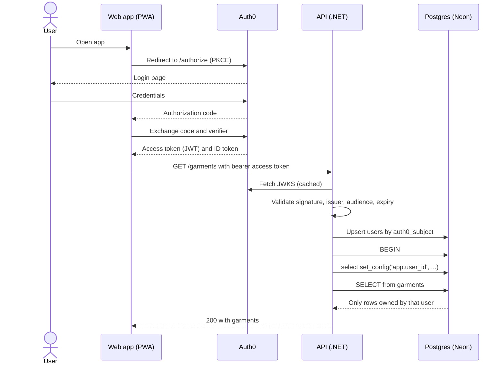

# Authentication and security

Buckl delegates identity to Auth0, validates tokens in the API, and enforces data isolation in
Postgres with Row-Level Security. Application code is one layer of defense; the database is the
one that must hold even if the application has a bug.

## Authentication flow

The web app is a public client (single-page app). It uses Authorization Code with PKCE through the
Auth0 SPA SDK and never handles passwords.



### Token validation (API)

- Authority (issuer) and audience come from configuration, never hard-coded.
- Every endpoint requires an authenticated user by default (`[Authorize]` as the fallback policy);
  only the health endpoint is anonymous. In the Development environment, `/openapi/v1.json` and
  `/scalar/v1` are anonymous too (see `apps/api/src/Buckl.Api/Program.cs`).
- A missing or invalid token yields `401`. A valid token that targets another user's resource
  yields `404`, so the API never leaks the existence of other users' rows.
- Tokens are validated against Auth0's JWKS, cached and refreshed on key rotation.
- Only RS256 tokens are accepted, with the subject kept as `sub`; a token without a usable
  subject is rejected. The settings and the details are in [API](api.md#authentication)
  ([ADR-0028](../adr/0028-validate-auth0-access-tokens-with-jwt-bearer.md)).

### Local user record

- On every authenticated request the API upserts a row in `users` keyed by the token's `sub`
  claim and binds the resulting local id to the request. The generated `users.id` (UUID) is what
  the rest of the system uses as `UserId`.
- The API stores nothing else from the token in v1. Display name and email stay in Auth0.

## Data isolation with Row-Level Security

1. Every user-scoped table (`garments`, later `outfits` and `wear_logs`) has a
   `user_id uuid not null` column.
2. Those tables get `ALTER TABLE ... ENABLE ROW LEVEL SECURITY` and `FORCE ROW LEVEL SECURITY`.
3. One policy per table covers all commands:

   ```sql
   create policy garments_owner on garments
       using      (user_id = nullif(current_setting('app.user_id', true), '')::uuid)
       with check (user_id = nullif(current_setting('app.user_id', true), '')::uuid);
   ```

   With `current_setting(..., true)` a missing variable yields `NULL`, and `nullif` turns the empty
   string a reused connection reports into `NULL` too, so a request that forgot to set it sees no
   rows instead of all rows or an error.

4. The API connects with a dedicated role (`buckl_app`) that owns no tables and has neither
   `BYPASSRLS` nor `SUPERUSER`. Migrations run with a separate role.
5. Per request, inside one transaction, the API executes
   `select set_config('app.user_id', @userId, true)`, the parameterized form of
   `SET LOCAL app.user_id`, before any query. A global MVC action filter opens that transaction
   and commits it only if the action succeeded. `SET LOCAL` dies with the transaction, so a
   pooled connection never carries a stale user into the next request.
6. Integration tests in phases 4 and 5 prove that two users cannot read or modify each other's
   rows, including attempts by id.

The full DDL, roles and grants are in [Database schema](database-schema.md).

## CORS

- The API allows only the web app's origins, from `Cors:AllowedOrigins`: `http://localhost:5173`
  (Vite dev server) and `http://localhost:4173` (Vite preview) in Development, the production
  origin from phase 9. An empty list allows no cross-origin call.
- Every entry must be an origin (scheme, host, optional port; no path, no trailing slash, no
  wildcard). The API refuses to start otherwise, because a browser never sends
  `https://buckl.app/` and the mismatch would silently cut the web app off.
- Allowed methods are `GET`, `POST` and `PATCH`; allowed request headers, `Authorization` and
  `Content-Type`. `Location` is exposed so the web app can read where a new garment lives.
  Credentials (cookies) are not allowed: the token travels in `Authorization`. Browsers may cache a
  preflight for ten minutes.
- CORS runs before authentication, so a preflight, which never carries a token, is answered
  without being challenged.
- CORS is a browser-side protection, complementary to authentication. It is not an access control:
  every request still needs a valid token.

## Secrets and configuration

- The web bundle is public. It contains only public configuration: Auth0 domain, client id,
  audience and the API base URL, as `VITE_` variables.
- Real secrets (database connection string, R2 access keys, migration role password) live only in
  the API, read from environment variables. `.env` files are ignored by git; `.env.example` files
  document the variable names without values, added in phase 5.
- CI runs gitleaks on every pull request and weekly. A leaked secret is rotated, not just removed.

## Photos

- The browser never receives storage credentials. To upload, the web app asks the API for a
  presigned PUT URL limited to a size, a content type and a key under `users/<userId>/`. To
  display, the API returns short-lived presigned GET URLs.
- Object keys embed the owner id so a key never points into another user's prefix, and the API
  checks the prefix before signing.

## Transport and headers

- HTTPS everywhere in production; the static host and the API host provide certificates.
- Every API response, errors included, carries `X-Content-Type-Options: nosniff`,
  `X-Frame-Options: DENY`, `Referrer-Policy: no-referrer`,
  `Content-Security-Policy: default-src 'none'; frame-ancestors 'none'` (except the development
  API reference, an HTML page), and `Cache-Control: no-store` unless the endpoint set its own.
- Outside Development, HTTPS responses carry `Strict-Transport-Security: max-age=31536000`. Behind
  a proxy that terminates TLS, the API only sees HTTPS once forwarded headers are configured
  (phase 9).
- Kestrel does not send a `Server` header.
- Rate limiting on import and upload endpoints comes in phase 10.

## Threats considered

| Threat                                    | Mitigation                                                         |
| ----------------------------------------- | ------------------------------------------------------------------ |
| Bug in a query forgets to filter by user  | RLS policy filters anyway; a missing `app.user_id` means no rows   |
| Stolen or forged token                    | Signature, issuer, audience and expiry validation; short lifetime  |
| Guessing another user's garment id        | RLS returns nothing and the API answers `404`                      |
| Credentials in the front-end bundle       | No secrets in the web app; presigned URLs for storage              |
| Secrets committed to git                  | gitleaks in CI, `.env` ignored, rotation on any leak               |
| Malicious product URL on import (phase 7) | SSRF guard: http and https only, no private IPs, timeout, size cap |
| Machine-to-machine token for the API      | No machine-to-machine application is authorized for the API        |
