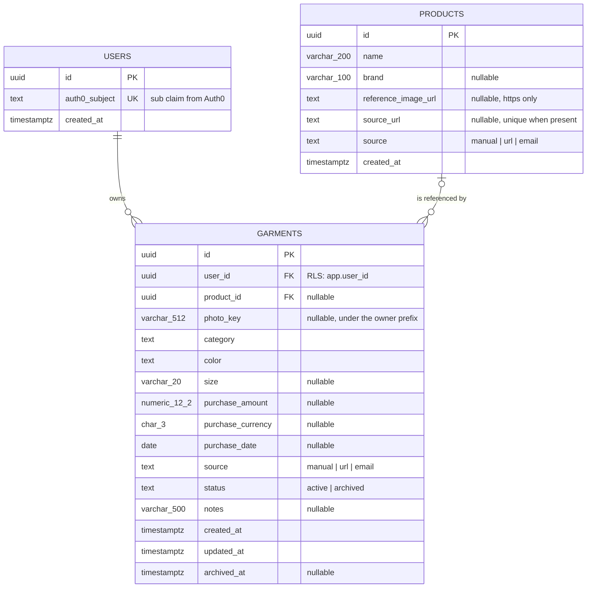

# Database schema

Column-level design of the Postgres schema, derived from the [domain model](domain-model.md). The
EF Core migrations of phase 4 are the executable source of truth; this document states what they
must produce and why. Names are `snake_case`, and enumerations are stored as lower-case text with
check constraints
([ADR-0016](../adr/0016-store-enumerations-as-text-with-check-constraints.md)).

## Entity relationship diagram



Mermaid does not accept parentheses in attribute types, so `varchar_200` above means
`varchar(200)` and `numeric_12_2` means `numeric(12,2)`. The statements below are the
authoritative form.

## Tables

### users

Created in phase 5, by the first authenticated request. It holds only what links a token to rows.

```sql
create table users (
    id            uuid primary key,
    auth0_subject text not null unique,
    created_at    timestamptz not null
);
```

No RLS policy: the row must be readable to resolve `app.user_id` before that variable is set. The
application role can only `select` and `insert`. The row carries no personal data beyond the
opaque Auth0 subject, as recorded in [Privacy and personal data](../privacy.md).

### products

The global catalog, immutable after insert in v1.

```sql
create table products (
    id                  uuid primary key,
    name                varchar(200) not null,
    brand               varchar(100),
    reference_image_url text,
    source_url          text,
    source              text not null,
    created_at          timestamptz not null,
    constraint products_name_not_blank    check (length(btrim(name)) > 0),
    constraint products_brand_not_blank   check (brand is null or length(btrim(brand)) > 0),
    constraint products_image_url_https   check (reference_image_url is null or reference_image_url like 'https://%'),
    constraint products_source_url_scheme check (source_url is null or source_url like 'http://%' or source_url like 'https://%'),
    constraint products_source_values     check (source in ('manual', 'url', 'email'))
);

create unique index products_source_url_key on products (source_url) where source_url is not null;
```

The partial unique index implements the leaning answer to the deduplication question in the domain
model: one product per exact `source_url`. `IProductRepository.FindBySourceUrlAsync` reads through
it.

### garments

User-scoped. Every constraint mirrors a domain rule, so a bug in application code cannot store a
state the domain would have rejected.

```sql
create table garments (
    id                uuid primary key,
    user_id           uuid not null references users (id) on delete cascade,
    product_id        uuid references products (id) on delete restrict,
    photo_key         varchar(512),
    category          text not null,
    color             text not null,
    size              varchar(20),
    purchase_amount   numeric(12, 2),
    purchase_currency char(3),
    purchase_date     date,
    source            text not null,
    status            text not null,
    notes             varchar(500),
    created_at        timestamptz not null,
    updated_at        timestamptz not null,
    archived_at       timestamptz,
    constraint garments_category_values check (category in ('top', 'bottom', 'dress', 'outerwear', 'footwear', 'accessory')),
    constraint garments_color_values    check (color in ('black', 'white', 'grey', 'navy', 'blue', 'red', 'green', 'yellow', 'brown', 'beige', 'pink', 'purple', 'orange', 'multicolor')),
    constraint garments_source_values   check (source in ('manual', 'url', 'email')),
    constraint garments_status_values   check (status in ('active', 'archived')),
    constraint garments_photo_key_under_owner check (photo_key is null or photo_key like 'users/' || user_id::text || '/_%'),
    constraint garments_size_not_blank  check (size is null or length(btrim(size)) > 0),
    constraint garments_purchase_amount_not_negative check (purchase_amount is null or purchase_amount >= 0),
    constraint garments_purchase_currency_format check (purchase_currency is null or purchase_currency ~ '^[A-Z]{3}$'),
    constraint garments_purchase_all_or_none check (
        (purchase_amount is null and purchase_currency is null and purchase_date is null) or
        (purchase_amount is not null and purchase_currency is not null and purchase_date is not null)),
    constraint garments_archived_at_matches_status check (
        (status = 'archived' and archived_at is not null) or
        (status = 'active' and archived_at is null)),
    constraint garments_updated_not_before_created check (updated_at >= created_at)
);

create index garments_owner_status_idx   on garments (user_id, status);
create index garments_owner_category_idx on garments (user_id, category);
create index garments_product_idx        on garments (product_id) where product_id is not null;
```

`PurchaseInfo` is flattened into three nullable columns, an owned type in EF Core; the all-or-none
constraint keeps them consistent. `purchase_date` is not compared with the current date in the
database, because "not in the future" is a rule at write time, not a property of stored data.

`on delete cascade` from `users` implements step 1 of account deletion in
[Privacy and personal data](../privacy.md). `on delete restrict` from `products` records that a
product is never deleted while a garment references it.

## Row-Level Security

```sql
alter table garments enable row level security;
alter table garments force row level security;

create policy garments_owner on garments
    using      (user_id = current_setting('app.user_id', true)::uuid)
    with check (user_id = current_setting('app.user_id', true)::uuid);
```

`products` and `users` have no policy. How the API sets `app.user_id` on every request is in
[Authentication and security](auth-and-security.md).

## Roles and grants

```sql
-- Owns the schema and runs migrations. Created once, outside the application.
create role buckl_migrator login password '<from environment>';

-- Used by the API at runtime. Owns nothing and cannot bypass RLS.
create role buckl_app login password '<from environment>' nobypassrls;

grant usage on schema public to buckl_app;
grant select, insert         on users    to buckl_app;
grant select, insert         on products to buckl_app;
grant select, insert, update on garments to buckl_app;
```

There is no `delete` grant on `garments` in v1: archiving is the domain operation, and physical
deletion happens only through account deletion, performed with the migrator role. On Neon the
default owner role plays `buckl_migrator`, and `buckl_app` is created with SQL from the console.
Passwords come from environment variables in phase 4 and are never written to this repository.

## Mapping from the domain

| Domain                                               | Column or columns                                       | Notes                                     |
| ---------------------------------------------------- | ------------------------------------------------------- | ----------------------------------------- |
| `GarmentId`, `ProductId`, `UserId`                   | `uuid`                                                  | Value converters unwrap the struct        |
| `Category`, `Color`, `ImportSource`, `GarmentStatus` | `text`                                                  | Enum name lower-cased (`Top` to `top`)    |
| `Size.Label`                                         | `size varchar(20)`                                      | Kept as written                           |
| `PhotoKey.Value`                                     | `photo_key varchar(512)`                                | Owner prefix checked in both places       |
| `PurchaseInfo`                                       | `purchase_amount`, `purchase_currency`, `purchase_date` | Owned type; all null when absent          |
| `Money.MaxAmount`                                    | `numeric(12,2)`                                         | The same ceiling on both sides            |
| `Garment.OwnerId`                                    | `user_id`                                               | The column RLS compares                   |
| `CreatedAt`, `UpdatedAt`, `ArchivedAt`               | `timestamptz`                                           | Written by the domain in UTC; no triggers |

## Later phases

- Phase 4 adds `__EFMigrationsHistory`, owned by the migrator role, and turns this document into
  the initial migration and the RLS migration.
- Phase 8 adds `outfits`, `outfit_garments` and `wear_logs`, each with a `user_id` column and the
  same policy shape.
