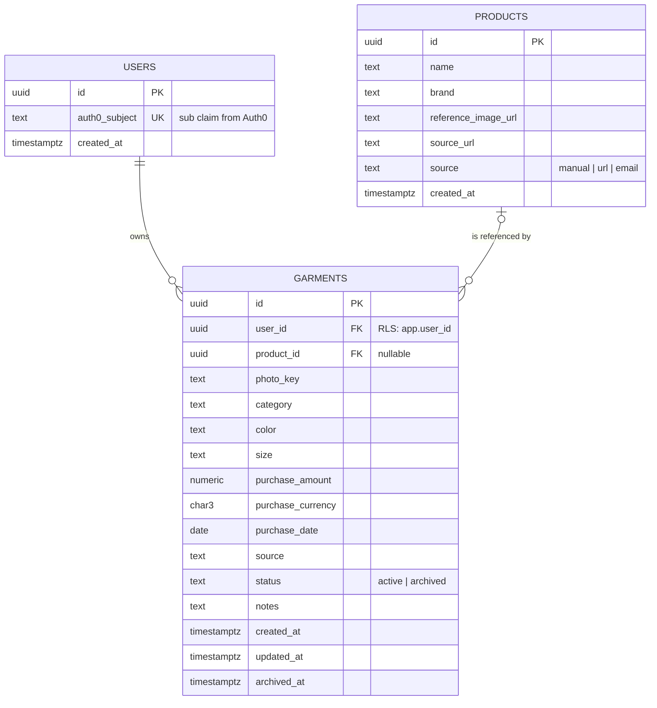

# Domain model

The domain is small on purpose: two aggregates, a handful of value objects, and rules that keep a
user's wardrobe consistent. Terms are defined in the [glossary](../glossary.md).

## Garment and Product are separate

A **Product** is the impersonal description of something a store sells: brand, name, reference
image, where it was imported from. A **Garment** is one user's physical copy of it: their photo,
their size, what they paid, whether they still wear it.

They are separate from the start because:

- A garment can exist without a product (a photographed shirt with no known origin), and a product
  can be referenced by many garments.
- Purchase price, size and photos are personal; brand and catalog image are not. Keeping them
  apart keeps Row-Level Security simple: `garments` is user-scoped, `products` is not.
- Post-v1 features (shared catalog, matching) build on Product without touching Garment.

## Aggregates

### Garment

| Attribute        | Type               | Rules                                                                                                                               |
| ---------------- | ------------------ | ----------------------------------------------------------------------------------------------------------------------------------- |
| `Id`             | `GarmentId` (GUID) | Generated by the domain on creation.                                                                                                |
| `OwnerId`        | `UserId`           | Required. Never changes. Maps to `user_id`, the column Row-Level Security filters on.                                               |
| `ProductId`      | `ProductId?`       | Optional link to the catalog article.                                                                                               |
| `PhotoKey`       | `PhotoKey?`        | Object key in photo storage. Optional at creation, because imports may rely on the product image. Must be under the owner's prefix. |
| `Classification` | `Classification`   | Required. Category and color are required, the size label is optional.                                                              |
| `PurchaseInfo`   | `PurchaseInfo?`    | Optional; price and date.                                                                                                           |
| `Source`         | `ImportSource`     | `Manual`, `Url` or `Email`. Set on creation.                                                                                        |
| `Status`         | `GarmentStatus`    | `Active` on creation, `Archived` after `Archive()`.                                                                                 |
| `Notes`          | `string?`          | Free text, at most 500 characters.                                                                                                  |
| `CreatedAt`      | `DateTimeOffset`   | Set by the domain, in UTC.                                                                                                          |
| `UpdatedAt`      | `DateTimeOffset`   | Updated on every change.                                                                                                            |
| `ArchivedAt`     | `DateTimeOffset?`  | Set by `Archive()`, cleared by `Restore()`.                                                                                         |

Behavior:

- `Garment.Create(ownerId, classification, source, now, photoKey?, purchaseInfo?, productId?, notes?)`
- `UpdateClassification(classification, now)`, `UpdatePurchaseInfo(purchaseInfo?, now)`,
  `ReplacePhoto(photoKey, now)`, `UpdateNotes(notes?, now)`
- `Archive(now)`, `Restore(now)`

Invariants:

- A garment belongs to exactly one user and the owner never changes.
- A garment's photo key always lives under its owner's prefix, so it can never point into another
  user's photos.
- Domain events are not used in v1; use cases in phase 4 orchestrate side effects directly.
- An archived garment cannot be edited; it must be restored first. `Archive(now)` on an archived
  garment throws `GarmentAlreadyArchivedException`, `Restore(now)` on an active one throws
  `GarmentNotArchivedException`, and any edit on an archived garment throws
  `ArchivedGarmentIsReadOnlyException`.
- Every mutation stamps `UpdatedAt` with the supplied instant, normalized to UTC.
- Deleting a garment is not a domain operation in v1; archiving is the way to remove it from the
  wardrobe. Physical deletion happens only with account deletion, described in
  [Privacy and personal data](../privacy.md).

### Product

| Attribute           | Type               | Rules                                                              |
| ------------------- | ------------------ | ------------------------------------------------------------------ |
| `Id`                | `ProductId` (GUID) | Generated on creation.                                             |
| `Name`              | `string`           | Required, trimmed, 1 to 200 characters.                            |
| `Brand`             | `string?`          | Optional, trimmed, at most 100 characters; blank becomes null.     |
| `ReferenceImageUrl` | `Uri?`             | Public image from the store, if any. Absolute `https` only.        |
| `SourceUrl`         | `Uri?`             | Product page when imported from a URL. Absolute `http` or `https`. |
| `Source`            | `ImportSource`     | How it was created.                                                |
| `CreatedAt`         | `DateTimeOffset`   | In UTC.                                                            |

Behavior: `Product.Create(name, source, now, brand?, referenceImageUrl?, sourceUrl?)`. Products are
immutable after creation in v1; an import that finds different data creates a new product.
Deduplication is an open question below.

Products are global records, not user-scoped: any authenticated user can read them, and only the
API writes them as a side effect of imports. A product row carries no personal data.

## Value objects

| Value object    | Shape                                | Validation                                                                                                                                                                                 |
| --------------- | ------------------------------------ | ------------------------------------------------------------------------------------------------------------------------------------------------------------------------------------------ |
| `Money`         | `decimal Amount`, `string Currency`  | Amount not negative, at most 2 decimals, at most 9 999 999 999.99 (`numeric(12,2)`); currency trimmed, upper-cased, three ASCII letters (ISO 4217 format; list membership is not checked). |
| `PurchaseInfo`  | `Money Price`, `DateOnly Date`       | Date not after the caller-supplied today.                                                                                                                                                  |
| `Category`      | enumeration                          | Fixed set defined in the domain: `Top`, `Bottom`, `Dress`, `Outerwear`, `Footwear`, `Accessory`. Finer sub-types may be added in phase 2.                                                  |
| `Color`         | C# `enum`, stored as lower-case text | Fixed palette defined in the domain: black, white, grey, navy, blue, red, green, yellow, brown, beige, pink, purple, orange, multicolor.                                                   |
| `Size`          | `string Label`                       | 1 to 20 characters, trimmed, kept as the user or store states it.                                                                                                                          |
| `ImportSource`  | C# `enum`, stored as lower-case text | `Manual`, `Url`, `Email`.                                                                                                                                                                  |
| `GarmentStatus` | C# `enum`, stored as lower-case text | `Active`, `Archived`.                                                                                                                                                                      |
| `PhotoKey`      | `string Value`, `UserId OwnerId`     | Object key, at most 512 characters, must start with `users/<userId>/` and carry a name after it. Verified by the domain on creation and by the API when issuing upload URLs.               |

### Implementation conventions

- Value objects are `sealed record` types with a private constructor and a static `Create(...)`
  factory that validates and throws. Equality is by value, generated by the compiler.
- The domain never reads the clock. Factories and mutators receive `DateTimeOffset now` or
  `DateOnly today` and normalize timestamps to UTC.
- Identifiers are `readonly record struct` types wrapping a GUID (`ProductId`, `GarmentId`,
  `UserId`), created with `New()`; an empty GUID is rejected. Aggregates are `sealed class` types
  with a private constructor and a static `Create` factory; identity is the id, and no custom
  equality is defined.
- Invalid input throws `DomainValidationException` with a stable code (`money.negative_amount`);
  illegal state transitions throw a dedicated exception per rule. See
  [ADR-0015](../adr/0015-signal-domain-rule-violations-with-typed-exceptions.md). Codes are
  constants on the type that raises them (`Money.Errors.NegativeAmount`) and are listed under
  [error codes](#error-codes).

## Ports

Defined in phase 2, implemented in phase 4. All members are asynchronous and take a
`CancellationToken`.

- `IGarmentRepository`: `GetByIdAsync(GarmentId)`, `ListByOwnerAsync(UserId, WardrobeFilter)`,
  `AddAsync(Garment)`, `UpdateAsync(Garment)`.
- `IProductRepository`: `GetByIdAsync(ProductId)`, `FindBySourceUrlAsync(Uri)`,
  `AddAsync(Product)`.

Repositories never take a user id as their authorization mechanism: Row-Level Security filters
rows. `ListByOwnerAsync` still receives the owner so application code filters explicitly as a
second layer, and `GetByIdAsync` returns null for a garment the current user cannot see, which the
API turns into a `404`.

`WardrobeFilter` describes the query: category, color, size, free text (trimmed, at most 100
characters) and status, which defaults to active garments. `HasCriteria` tells a caller whether
anything actually narrows the list; status alone does not count, since every listing has one.

## Entity relationship diagram

`outfits`, `outfit_garments` and `wear_logs` arrive in phase 8 and are added here then. The
column-level schema (indexes, constraints, RLS policies) is specified in phase 2 in a separate
database schema document.

## Ownership and isolation

- Every user-scoped table has a `user_id` column and an RLS policy comparing it with
  `current_setting('app.user_id')`. See
  [Authentication and security](auth-and-security.md).
- `products` has no `user_id` and no RLS policy; it is read-only for the application role except
  through the import use cases.

### Error codes

Every code the domain can raise, so the API can map them to problem details without matching on
message text. The table grows with each pull request that adds a rule.

| Code                                   | Raised by                                 | Meaning                               |
| -------------------------------------- | ----------------------------------------- | ------------------------------------- |
| `money.negative_amount`                | `Money.Create`                            | Amount below zero                     |
| `money.too_many_decimals`              | `Money.Create`                            | More than two decimal places          |
| `money.amount_too_large`               | `Money.Create`                            | Above `numeric(12,2)` capacity        |
| `money.invalid_currency`               | `Money.Create`                            | Not three ASCII letters               |
| `purchase_info.date_in_future`         | `PurchaseInfo.Create`                     | Purchase date after today             |
| `size.empty`                           | `Size.Create`                             | Blank size label                      |
| `size.too_long`                        | `Size.Create`                             | Size label over 20 characters         |
| `classification.unknown_category`      | `Classification.Create`                   | Category outside the enum             |
| `classification.unknown_color`         | `Classification.Create`                   | Color outside the enum                |
| `product_id.empty`                     | `ProductId` constructor                   | Empty GUID                            |
| `product.name_empty`                   | `Product.Create`                          | Blank name                            |
| `product.name_too_long`                | `Product.Create`                          | Name over 200 characters              |
| `product.brand_too_long`               | `Product.Create`                          | Brand over 100 characters             |
| `product.image_url_not_https`          | `Product.Create`                          | Image URL not absolute https          |
| `product.source_url_invalid`           | `Product.Create`                          | Source URL not absolute http or https |
| `product.unknown_source`               | `Product.Create`                          | Import source outside the enum        |
| `user_id.empty`                        | `UserId` constructor                      | Empty GUID                            |
| `garment_id.empty`                     | `GarmentId` constructor                   | Empty GUID                            |
| `photo_key.empty`                      | `PhotoKey.Create`                         | Blank key                             |
| `photo_key.too_long`                   | `PhotoKey.Create`                         | Key over 512 characters               |
| `photo_key.outside_owner_prefix`       | `PhotoKey.Create`                         | Key not under `users/<ownerId>/`      |
| `garment.unknown_source`               | `Garment.Create`                          | Import source outside the enum        |
| `garment.photo_not_owned`              | `Garment.Create`                          | Photo belongs to another user         |
| `garment.notes_too_long`               | `Garment.Create`                          | Notes over 500 characters             |
| `garment.already_archived`             | `Garment.Archive`                         | Archiving an archived garment         |
| `garment.not_archived`                 | `Garment.Restore`                         | Restoring an active garment           |
| `garment.archived_read_only`           | `Garment.Update*`, `Garment.ReplacePhoto` | Editing an archived garment           |
| `wardrobe_filter.search_text_too_long` | `WardrobeFilter.SearchText`               | Search text over 100 characters       |

## Open questions

- Product deduplication: when two imports resolve to the same `source_url`, reuse the product or
  create a new one? Leaning towards reusing by exact `source_url`; revisit in phase 7.
- Multiple colors per garment: v1 stores one dominant color. Revisit when outfit rules need more.
