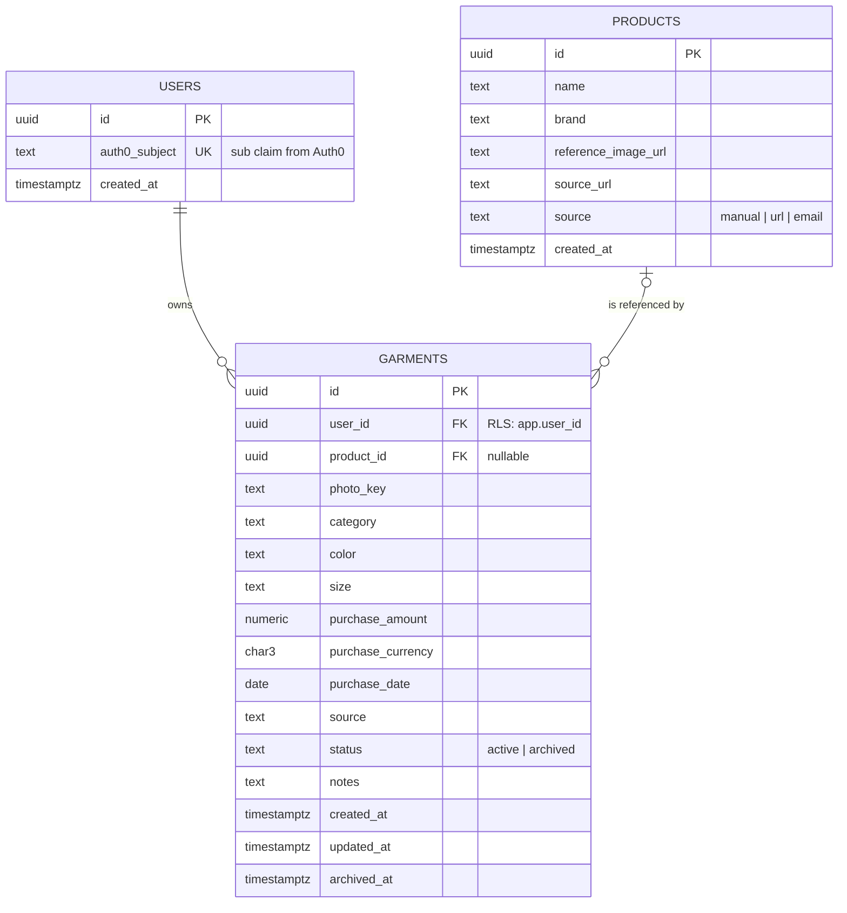

# Domain model

The domain is small on purpose: two aggregates, a handful of value objects, and rules that keep a
user's wardrobe consistent. Terms are defined in the [glossary](../glossary.md).

## Garment and Product are separate

A **Product** is the impersonal description of something a store sells: brand, name, reference
image, where it was imported from. A **Garment** is one user's physical copy of it: their photo,
their size, what they paid, whether they still wear it.

They are separate from the start because:

- A garment can exist without a product (a photographed shirt with no known origin), and a product
  can be referenced by many garments.
- Purchase price, size and photos are personal; brand and catalog image are not. Keeping them
  apart keeps Row-Level Security simple: `garments` is user-scoped, `products` is not.
- Post-v1 features (shared catalog, matching) build on Product without touching Garment.

## Aggregates

### Garment

| Attribute      | Type               | Rules                                                                                             |
| -------------- | ------------------ | ------------------------------------------------------------------------------------------------- |
| `Id`           | `GarmentId` (GUID) | Generated by the domain on creation.                                                              |
| `UserId`       | `UserId`           | Required. Never changes. Owner for RLS.                                                           |
| `ProductId`    | `ProductId?`       | Optional link to the catalog article.                                                             |
| `PhotoKey`     | `PhotoKey?`        | Object key in photo storage. Optional at creation, because imports may rely on the product image. |
| `Category`     | `Category`         | Required.                                                                                         |
| `Color`        | `Color`            | Required.                                                                                         |
| `Size`         | `Size?`            | Optional label.                                                                                   |
| `PurchaseInfo` | `PurchaseInfo?`    | Optional; price and date.                                                                         |
| `Source`       | `ImportSource`     | `Manual`, `Url` or `Email`. Set on creation.                                                      |
| `Status`       | `GarmentStatus`    | `Active` on creation, `Archived` after `Archive()`.                                               |
| `Notes`        | `string?`          | Free text, at most 500 characters.                                                                |
| `CreatedAt`    | `DateTimeOffset`   | Set by the domain, in UTC.                                                                        |
| `UpdatedAt`    | `DateTimeOffset`   | Updated on every change.                                                                          |
| `ArchivedAt`   | `DateTimeOffset?`  | Set by `Archive()`, cleared by `Restore()`.                                                       |

Behavior:

- `Garment.Create(userId, category, color, source, photoKey?, size?, purchaseInfo?, productId?, notes?)`
- `UpdateClassification(category, color, size?)`, `UpdatePurchaseInfo(purchaseInfo?)`,
  `ReplacePhoto(photoKey)`, `UpdateNotes(notes?)`
- `Archive()`, `Restore()`

Invariants:

- A garment belongs to exactly one user and the owner never changes.
- An archived garment cannot be edited; it must be restored first. `Archive()` on an archived
  garment and `Restore()` on an active one are errors (`GarmentAlreadyArchived`,
  `GarmentNotArchived`).
- Deleting a garment is not a domain operation in v1; archiving is the way to remove it from the
  wardrobe. Physical deletion happens only with account deletion.

### Product

| Attribute           | Type               | Rules                                              |
| ------------------- | ------------------ | -------------------------------------------------- |
| `Id`                | `ProductId` (GUID) | Generated on creation.                             |
| `Name`              | `string`           | Required, 1 to 200 characters.                     |
| `Brand`             | `string?`          | Optional, at most 100 characters.                  |
| `ReferenceImageUrl` | `Uri?`             | Public image from the store, if any. Only `https`. |
| `SourceUrl`         | `Uri?`             | Product page URL when imported from a URL.         |
| `Source`            | `ImportSource`     | How it was created.                                |
| `CreatedAt`         | `DateTimeOffset`   | In UTC.                                            |

Behavior: `Product.Create(name, source, brand?, referenceImageUrl?, sourceUrl?)`. Products are
immutable after creation in v1; an import that finds different data creates a new product.
Deduplication is an open question below.

Products are global records, not user-scoped: any authenticated user can read them, and only the
API writes them as a side effect of imports. A product row carries no personal data.

## Value objects

| Value object    | Shape                               | Validation                                                                                                                                |
| --------------- | ----------------------------------- | ----------------------------------------------------------------------------------------------------------------------------------------- |
| `Money`         | `decimal Amount`, `string Currency` | Amount not negative, at most 2 decimals; currency is a 3-letter ISO 4217 code, upper case.                                                |
| `PurchaseInfo`  | `Money Price`, `DateOnly Date`      | Date not in the future.                                                                                                                   |
| `Category`      | enumeration                         | Fixed set defined in the domain: `Top`, `Bottom`, `Dress`, `Outerwear`, `Footwear`, `Accessory`. Finer sub-types may be added in phase 2. |
| `Color`         | enumeration                         | Fixed palette defined in the domain: black, white, grey, navy, blue, red, green, yellow, brown, beige, pink, purple, orange, multicolor.  |
| `Size`          | `string Label`                      | 1 to 20 characters, trimmed, kept as the user or store states it.                                                                         |
| `ImportSource`  | enumeration                         | `Manual`, `Url`, `Email`.                                                                                                                 |
| `GarmentStatus` | enumeration                         | `Active`, `Archived`.                                                                                                                     |
| `PhotoKey`      | `string Value`                      | Object key, must start with `users/<userId>/`, enforced by the API when issuing upload URLs.                                              |

Value objects are immutable and compared by value. Invalid input throws a typed domain error,
never returns a half-built object.

## Ports

Defined in phase 2, implemented in phase 4.

- `IGarmentRepository`: `GetById(GarmentId)`, `ListByUser(UserId, WardrobeFilter)`, `Add`,
  `Update`.
- `IProductRepository`: `GetById(ProductId)`, `FindBySourceUrl(Uri)`, `Add`.

Repositories never take a user id as an authorization argument: RLS filters rows, the repository
only expresses the query.

## Entity relationship diagram

`outfits`, `outfit_garments` and `wear_logs` arrive in phase 8 and are added here then. The
column-level schema (indexes, constraints, RLS policies) is specified in phase 2 in a separate
database schema document.

## Ownership and isolation

- Every user-scoped table has a `user_id` column and an RLS policy comparing it with
  `current_setting('app.user_id')`. The mechanism is described in the authentication and security
  document.
- `products` has no `user_id` and no RLS policy; it is read-only for the application role except
  through the import use cases.

## Open questions

- Product deduplication: when two imports resolve to the same `source_url`, reuse the product or
  create a new one? Leaning towards reusing by exact `source_url`; revisit in phase 7.
- Multiple colors per garment: v1 stores one dominant color. Revisit when outfit rules need more.
