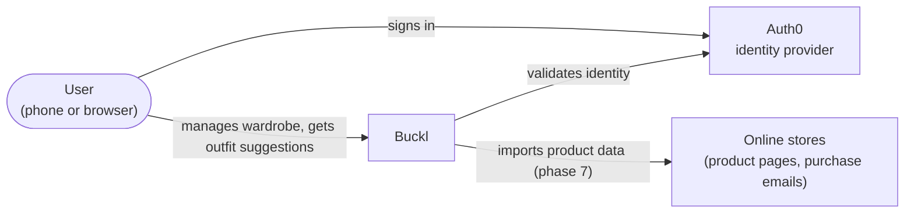
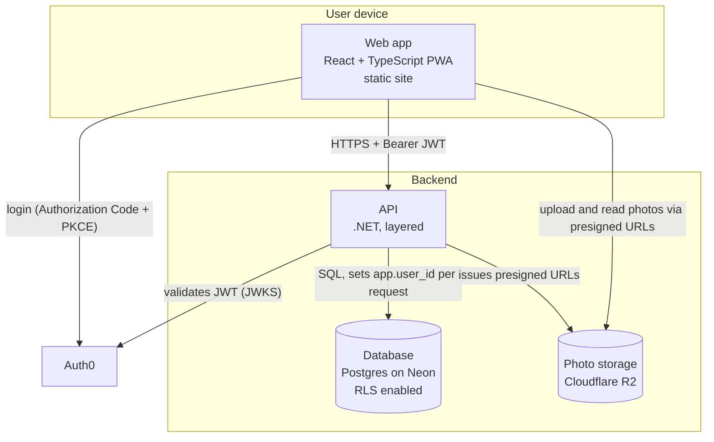
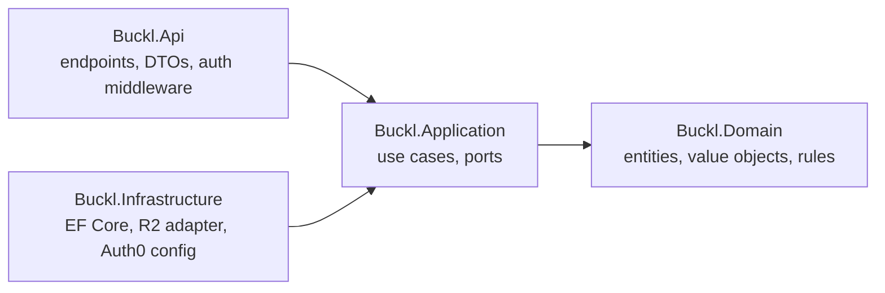

# Architecture overview

## What Buckl is

Buckl is a personal wardrobe app. You photograph or import the clothes you own, browse them from
your phone or the browser, and from phase 8 build outfits and get suggestions on what to wear
without pulling everything out of the closet.

It is a portfolio project: there is no revenue goal, it must run on free tiers, and it is meant to
show clean architecture, security awareness and testing discipline. It is used both as an
installed PWA on the phone and as a web app in the browser. The phone is the primary device,
because that is where the camera is and where product URLs get shared.

## Goals and constraints

- Free to run: static hosting for the web app, free tiers for database, storage and identity.
- Every user sees only their own data, enforced in the database, not only in application code.
- Clean layering (a domain with no infrastructure dependencies), SOLID, tested with TDD.
- Starts on localhost; deployment is a later phase and must stay free.

## System context

## Containers

| Container     | Technology                              | Responsibility                                                                 | Hosting (phase 9)                            |
| ------------- | --------------------------------------- | ------------------------------------------------------------------------------ | -------------------------------------------- |
| Web app       | React 19, Vite, TypeScript, Vitest, PWA | UI, camera capture, offline shell, calls the API with the user's token         | Static site (Cloudflare Pages or equivalent) |
| API           | .NET (ASP.NET Core), EF Core            | Domain rules, use cases, authorization, RLS session binding, presigned uploads | Free container or app host, to be chosen     |
| Database      | Postgres on Neon                        | Persistent data with Row-Level Security policies                               | Neon free tier                               |
| Photo storage | Cloudflare R2 (S3-compatible)           | Garment photos, accessed only through presigned URLs                           | R2 free tier                                 |
| Identity      | Auth0                                   | Sign-up, login, tokens; Buckl stores no passwords                              | Auth0 free tier                              |

## API layering

The API follows a layered (clean) architecture with dependencies pointing inward only.

- `Buckl.Domain` has no dependencies. Entities (`Garment`, `Product`), value objects (`Money`,
  `PurchaseInfo`, `Category`, `Size`, `Color`) and repository interfaces live here.
- `Buckl.Application` orchestrates use cases (`ListWardrobe`, `CreateGarment`, and the rest)
  against the domain and its ports.
- `Buckl.Infrastructure` implements the ports: EF Core repositories, RLS session interceptor, R2
  storage adapter.
- `Buckl.Api` exposes HTTP endpoints, validates tokens and maps errors to ProblemDetails.
- Architecture tests (phase 4) fail the build if a layer references one it must not.

## Repository layout

Buckl is a monorepo with npm workspaces. `apps/web` is an npm workspace; `apps/api`, from phase 2,
is a .NET solution built by its own CI job rather than an npm workspace. `docs/` holds this
documentation.

CI runs on every pull request: lint, typecheck, tests and build for the web, plus secret scanning
and a dependency audit. The API job is added when the solution exists.

## A request end to end

Loading the wardrobe, once every phase is in place:

1. The user opens the app; the PWA shell loads from the static host.
2. If there is no session, the web app redirects to Auth0 and receives an access token.
3. The web app calls `GET /garments` with `Authorization: Bearer <token>`.
4. The API validates the token, upserts the local `User`, opens a transaction and executes
   `SET LOCAL app.user_id = '<user id>'`.
5. EF Core queries `garments`; RLS policies filter rows to that user.
6. For each garment with a photo, the API returns a short-lived signed read URL for R2.
7. The web app renders the grid; photos load directly from R2.

## Cross-cutting concerns

- Data model: see [Domain model](domain-model.md).
- Security: see [Authentication and security](auth-and-security.md).
- Privacy: the privacy and personal data document, added in a following pull request.
- Decisions: see the [ADR log](../adr/README.md).
